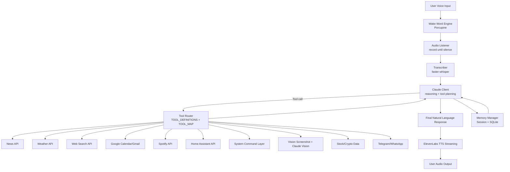
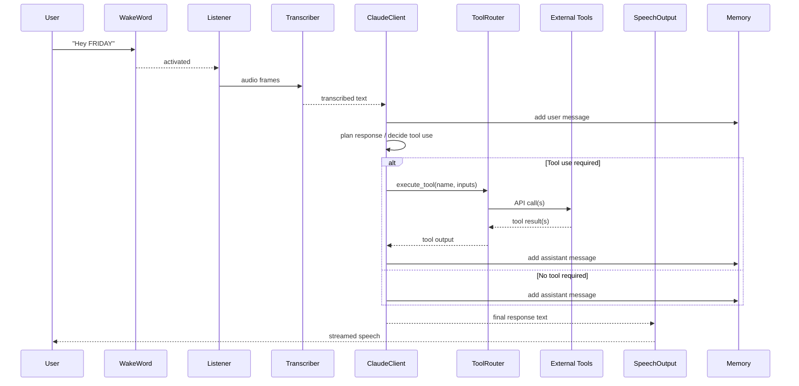
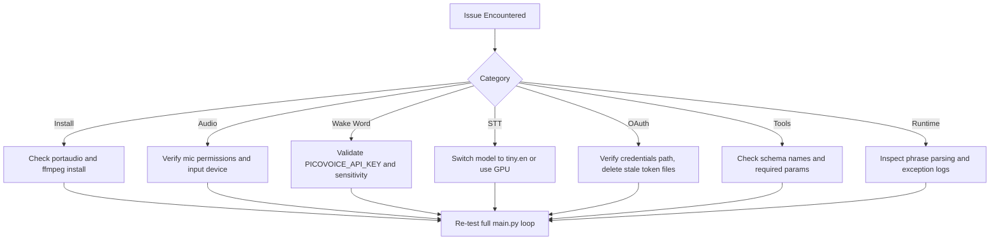

# FRIDAY Pro Documentation

This is the single-file, professional reference for building and operating F.R.I.D.A.Y. (Female Replacement Intelligent Digital Assistant Youth).

It consolidates setup, architecture, configuration, tool contracts, command behavior, security, performance, testing, troubleshooting, and contribution workflow from the docs set and root README.

## Table of Contents

1. Executive Summary
2. System Architecture
3. Runtime Sequence
4. Component Design
5. Project Structure
6. Installation and Quick Start
7. Configuration and Environment Variables
8. Tooling and API Contract
9. Voice Command Catalog
10. Security and Operational Hardening
11. Performance Engineering
12. Testing and Validation
13. Troubleshooting Playbook
14. Development Roadmap
15. Contribution Workflow
16. Production Readiness Checklist

## 1) Executive Summary

FRIDAY is a voice-first assistant pipeline:

- Wake word detection (Porcupine)
- Local speech-to-text (faster-whisper)
- Claude reasoning with tool-calling (Anthropic)
- Multi-tool action execution (news, weather, search, calendar, email, Spotify, smart home, system, vision, market data, messaging)
- Streaming text-to-speech output (ElevenLabs)
- Session + persistent memory (SQLite)

Core design goals:

- Conversational responsiveness
- Deterministic tool interfaces
- Extensible modular architecture
- Safe-by-default operations

## 2) System Architecture



## 3) Runtime Sequence



## 4) Component Design

### Voice Layer

- Wake word detector: blocks until keyword trigger.
- Audio listener: captures mic data until configured silence.
- Transcriber: converts captured waveform to text.

### Brain Layer

- Claude client orchestrates reasoning and tool execution loop.
- Personality prompt enforces style and behavioral constraints.
- Memory stores session context and persistent records in SQLite.

### Tool Layer

- Tool definitions describe JSON input schemas.
- Tool map provides strict function routing.
- Dispatcher performs safe execution with exception handling.

### Output Layer

- TTS streams synthesized speech with low-latency settings.

## 5) Project Structure

```text
friday/
├── .env
├── main.py
├── requirements.txt
├── config.py
├── brain/
│   ├── claude_client.py
│   ├── memory.py
│   └── personality.py
├── voice/
│   ├── wake_word.py
│   ├── listener.py
│   └── transcriber.py
├── speech/
│   └── tts.py
├── tools/
│   ├── news.py
│   ├── weather.py
│   ├── search.py
│   ├── calendar_tool.py
│   ├── email_tool.py
│   ├── spotify_tool.py
│   ├── smart_home.py
│   ├── system_tool.py
│   ├── vision.py
│   ├── stocks.py
│   └── messaging.py
├── hud/
│   └── display.py
└── friday.db
```

## 6) Installation and Quick Start

### Prerequisites

- Python 3.10+
- Microphone and speakers
- System libraries: portaudio, ffmpeg
- Core API keys: Anthropic, ElevenLabs, Picovoice

### OS Dependencies

macOS:

```bash
brew install portaudio ffmpeg
```

Ubuntu/Debian:

```bash
sudo apt install portaudio19-dev ffmpeg python3-dev
```

Windows:

```bash
pip install pipwin
pipwin install pyaudio
```

### Environment and Python Dependencies

```bash
python -m venv friday_env
source friday_env/bin/activate

pip install anthropic faster-whisper elevenlabs pvporcupine pyaudio
pip install sounddevice soundfile numpy requests
pip install google-auth google-auth-oauthlib google-api-python-client
pip install spotipy yfinance wikipedia-api python-telegram-bot pillow schedule python-dotenv
```

### First Run

```bash
python main.py
```

Expected first interaction path:

1. Wake-word listening starts.
2. You say "Hey FRIDAY".
3. FRIDAY acknowledges and enters conversation loop.

## 7) Configuration and Environment Variables

### Core Variables

```env
ANTHROPIC_API_KEY=...
ELEVENLABS_API_KEY=...
ELEVENLABS_VOICE_ID=...
PICOVOICE_API_KEY=...
```

### Optional Tool Variables

```env
NEWS_API_KEY=...
OPENWEATHER_API_KEY=...
TAVILY_API_KEY=...
SPOTIFY_CLIENT_ID=...
SPOTIFY_CLIENT_SECRET=...
SPOTIFY_REDIRECT_URI=http://localhost:8888/callback
HOME_ASSISTANT_URL=http://homeassistant.local:8123
HOME_ASSISTANT_TOKEN=...
TELEGRAM_BOT_TOKEN=...
TELEGRAM_CHAT_ID=...
GOOGLE_CREDENTIALS_PATH=credentials.json
```

### Runtime Tuning Defaults

- Whisper model: base.en
- Listener sample rate: 16000
- Silence threshold: 0.015
- Silence duration: 1.8 seconds
- Claude model: claude-sonnet-4-20250514

## 8) Tooling and API Contract

### Core Function Contracts

- ask_friday(user_text: str) -> str
- wait_for_wake_word() -> None
- record_until_silence() -> np.ndarray
- transcribe(audio: np.ndarray) -> str
- speak(text: str) -> None
- execute_tool(name: str, inputs: dict) -> str

### Supported Tool Actions

- News: get_news
- Weather: get_weather
- Search: web_search
- Calendar: get_upcoming_events, create_event
- Email: read_emails, send_email
- Spotify: play_song, pause_music, resume_music, next_track, set_volume
- Smart Home: turn_on, turn_off, set_light_brightness, get_entity_state
- System: open_application, run_command, get_system_info
- Vision: describe_screen
- Markets: get_stock_price, get_crypto_price
- Messaging: send_telegram, send_whatsapp

## 9) Voice Command Catalog

### Information

- Hey FRIDAY, what is the news today?
- Hey FRIDAY, what is the weather in London?
- Hey FRIDAY, search for the latest iPhone release.
- Hey FRIDAY, how is Bitcoin doing?
- Hey FRIDAY, what is Apple stock price?

### Productivity

- Hey FRIDAY, what is on my calendar this week?
- Hey FRIDAY, read my last 5 emails.
- Hey FRIDAY, set a reminder for my 3pm meeting.

### Device and Home Control

- Hey FRIDAY, open Chrome.
- Hey FRIDAY, how is my computer running?
- Hey FRIDAY, what is on my screen right now?
- Hey FRIDAY, turn on the living room lights.
- Hey FRIDAY, send a Telegram to my phone: I am on my way.

### Runtime Control Phrases

- shut down / goodbye friday / power off
- clear memory
- morning briefing

## 10) Security and Operational Hardening

### Secrets and Tokens

- Store secrets in .env only.
- Never commit .env, token_calendar.pkl, token_gmail.pkl, or credentials files.
- Rotate exposed secrets immediately.

### Command and Tool Safety

- Restrict shell command surfaces to trusted contexts.
- Use least-privilege tokens for smart home and messaging APIs.
- Validate destinations before outbound messages.

### Data Handling

- Conversation history persists in friday.db.
- Encrypt and control backup distribution.
- Define data retention and deletion procedure for shared deployments.

## 11) Performance Engineering

### Primary Levers

1. Whisper model size
- tiny.en for speed
- base.en for balanced quality

2. Hardware path
- CPU: device=cpu, compute_type=int8
- GPU: device=cuda

3. Audio responsiveness
- Tune silence duration lower for faster turn-taking

4. Network efficiency
- Set explicit API timeouts
- Cache repeat high-frequency requests where acceptable

5. TTS latency
- Use low-latency ElevenLabs model settings
- Keep responses concise for faster perceived interaction

## 12) Testing and Validation

### Setup Validation

- Python version and dependency checks pass.
- .env loads core keys successfully.

### Functional Smoke Tests

- Wake word triggers reliably.
- Transcription quality is acceptable.
- Claude responds to both tool and non-tool prompts.
- At least one tool call succeeds.
- TTS playback is audible and stable.

### Regression Validation

- Tool schema names still match dispatcher names.
- Memory session and persistence paths remain valid.
- Shutdown and memory-reset phrases still work.

## 13) Troubleshooting Playbook



### Fast Diagnostic Order

1. Verify environment variables loaded.
2. Validate microphone and speaker path.
3. Test a direct Claude call.
4. Test one tool endpoint manually.
5. Re-run complete interaction loop.

## 14) Development Roadmap

### Near-Term

- Reliability: structured logging, retries, better failure narratives
- Security: command allowlists, key lifecycle, safer defaults
- Performance: latency instrumentation and profile-based tuning

### Mid-Term

- Proactive alerts and briefing automation
- Rich real-time HUD experience
- Enhanced memory retrieval and summarization

### Long-Term

- Identity-aware interaction
- Real-time translation capabilities
- Robotics/drone control integrations
- Advanced multimodal situational analysis

## 15) Contribution Workflow

1. Fork and create feature branch from main.
2. Implement focused changes.
3. Update this master document and README if behavior changes.
4. Submit PR with verification notes and risk summary.

Commit examples:

- docs: update FRIDAY pro guide with new tool schema
- fix: harden tool dispatcher error handling
- feat: add retry strategy for weather and news endpoints

## 16) Production Readiness Checklist

- Core and optional API credentials managed securely.
- Tool permissions and operational boundaries defined.
- Monitoring for failures and latency in place.
- Data retention and deletion policy documented.
- Runbook exists for OAuth token refresh and secret rotation.
- Recovery path tested (backup and restore).

---

Use this file as the primary technical handbook when onboarding, reviewing architecture, or preparing implementation changes.
